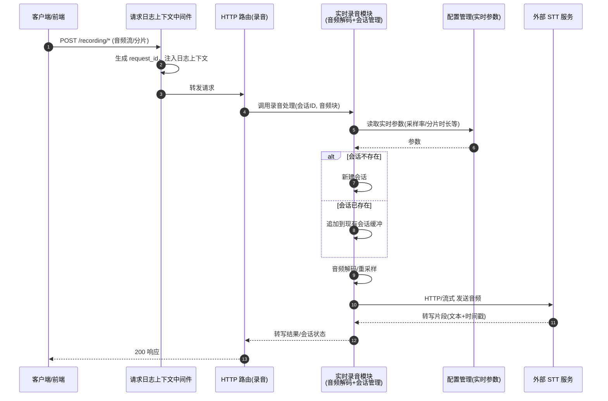
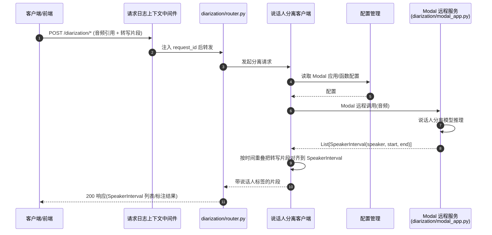
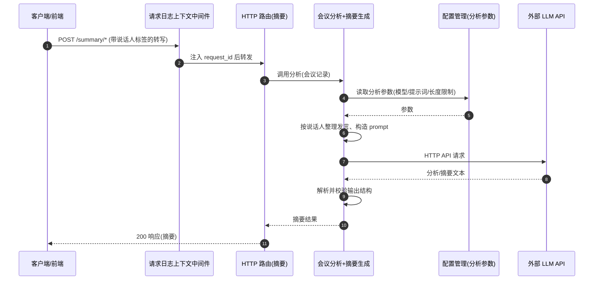
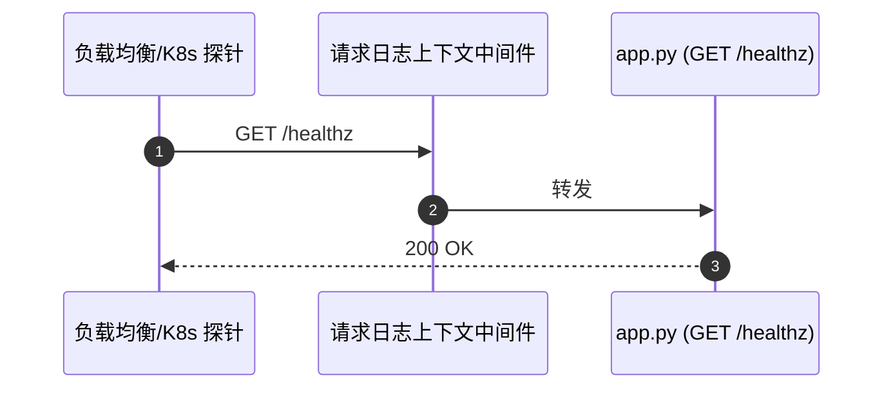

# 核心业务场景序列图
<!-- search-anchor: 流程, 场景, 序列图, sequence, 业务流, 完整流程 -->

> 依据说明：提供的调用链只有静态 import 路径，可确认的入口只有 `GET /healthz`、`SpeakerInterval`（diarization/router.py）、`app.py:main` 和 `diarization/modal_app.py:main`。下面三个业务场景对应架构文档中的"录音 / 分离 / 摘要"三项能力。图中的交互细节是根据架构文档推断的，没有逐行核对源码。4 个 HTTP 接口的具体路径文档里没写，所以图中用 `POST /recording/*` 这类占位路径代替。可识别的真实场景有 4 个，不补虚构场景。

## 场景 1: 实时录音与语音转写

关键决策：会话管理在录音模块内部完成。同一会话的多个音频分片按会话 ID 聚合，解码之后才发给 STT，所以 STT 服务本身不需要保存状态。采样率、分片时长等实时参数由配置模块统一管理，不在代码里写死。STT 调用失败属于外部依赖错误，需要在这一层转换成 HTTP 错误码返回（src 模块中有 11 条 error 类 fact 支持这一点）。

## 场景 2: 说话人分离（转写片段 → 说话人归属）

关键决策：分离模型需要 GPU，所以单独部署在 Modal 上（`modal_app.py` 有自己的 `main` 入口），主应用只作为客户端发起远程调用，两边可以分别部署和扩缩容。`SpeakerInterval` 是两侧之间的数据契约，对外暴露。片段和说话人的对应关系在客户端一侧用时间区间重叠来计算，Modal 端只负责输出说话人区间。

## 场景 3: 会议分析与摘要生成

关键决策：摘要以场景 2 的输出（带说话人的转写）为输入，所以三个能力组成 录音 → 分离 → 摘要 这条流水线。每个环节都有自己的独立接口，客户端可以按阶段分别调用和重试。模型、提示词等分析参数与实时参数分开配置，调整摘要策略不会影响录音链路。

## 场景 4: 健康检查

关键决策：`/healthz` 在 `app.py:39` 中直接定义，不经过业务层，也不调用外部服务，只用于判断进程是否存活。它不检查 STT、Modal、LLM 这些依赖是否可用，如果需要检查依赖就绪状态，得另加 readiness 接口。

我只拿到了你提供的摘要，没能读到源码：本机搜索仓库的命令需要权限批准，这一步没有执行。如果你给我本地仓库路径，我可以把场景 1–3 中的占位路径和函数名换成真实名称。